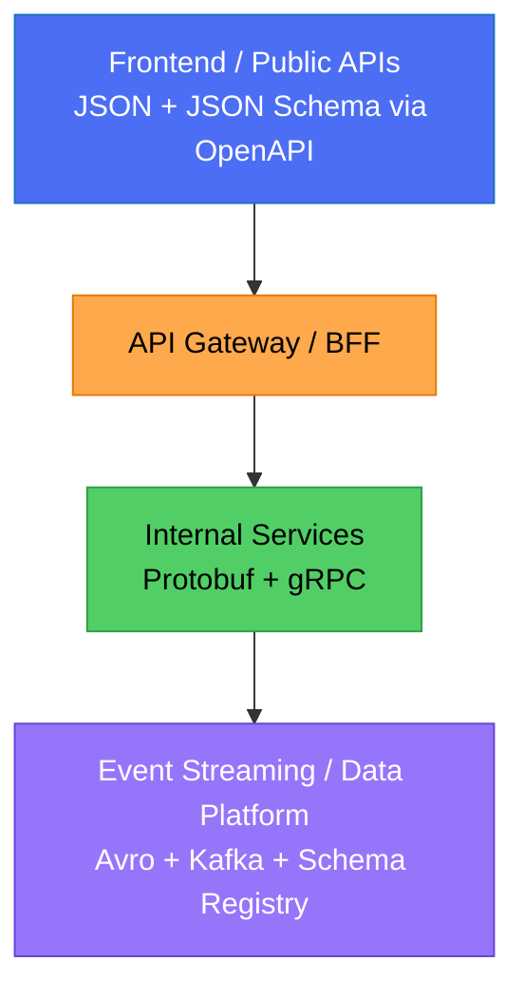

# Choosing a Data Serialization Format: A Hands-On Comparison of Avro, Protobuf and JSON Schema


**Author**: Wallace Espindola
**Email**: wallace.espindola@gmail.com
**LinkedIn**: https://www.linkedin.com/in/wallaceespindola/
**GitHub**: https://github.com/wallaceespindola/
**Companion repo**: https://github.com/wallaceespindola/avro-protobuf-jsonschema

---

Every service you build eventually has to answer one boring but expensive question: how do I put this data on the wire? Pick JSON everywhere and you'll pay for it in payload size and CPU cycles. Pick Protobuf everywhere and your public API becomes unreadable to anyone without the schema. Pick Avro everywhere and your frontend team will ask why they need a `.avsc` file to call a REST endpoint.

The honest answer is that there's no single right format. There's a right format for each boundary in your system. I put together a small FastAPI project that exposes the exact same `User` payload through three endpoints (one for JSON, one for Protobuf and one for Avro) so I could stop arguing about this in the abstract and actually look at the trade-offs side by side. The full source, including tests and a Docker setup, lives in the [companion repo](https://github.com/wallaceespindola/avro-protobuf-jsonschema). This article walks through what I found.

## Why the Format Choice Matters

Picking a serialization format isn't just a technical detail you bolt on at the end. It shapes how your teams evolve APIs without breaking each other, how much bandwidth and CPU your services burn under load and how easy it is for a new engineer to read a payload without special tooling.

Get it wrong and you'll feel it later: a public API that breaks every mobile client when you add a field, an internal service mesh that's spending more time serializing than doing actual work or a Kafka topic where nobody can agree what the message shape is supposed to look like six months from now.

Get it right, and each part of your system talks in the format that fits its constraints: readable JSON at the edge, compact binary internally and schema-governed binary for anything that has to survive years of change.

## Quick Definitions

Before comparing them, here's what each format actually is, in plain terms.

**Apache Avro** is a binary serialization format built around schema evolution. The schema and the data are closely tied together, which is why Avro shows up so often in Kafka and big data pipelines: you can change the schema over time and old and new consumers still agree on how to read the data.

**Protocol Buffers (Protobuf)** is a compact binary format with `.proto` schema files and generated code. Google built it for fast, small, strongly-typed service-to-service communication, and it's the backbone of gRPC.

**JSON Schema** isn't a serialization format at all. It's a way to describe and validate the structure of JSON documents. JSON itself is what actually goes over the wire, and it's still the most universally understood format because every browser, every language and every debugging tool can read it without help.

## Comparison at a Glance

| Feature | **JSON (+ JSON Schema)** | **Protobuf** | **Avro** |
|---|---|---|---|
| Encoding | Text | Binary | Binary |
| Human-readable | Yes | No | No |
| Payload size | Large | Very small | Small |
| Performance | Medium | Very high | High |
| Schema evolution | Moderate | Very good | Excellent |
| Browser support | Native | No | No |
| Typical ecosystem | REST, OpenAPI | gRPC, microservices | Kafka, Spark, Flink |
| Best fit | Public/browser-facing APIs | Internal microservices | Data pipelines and streaming |

This table is the same one from the project's [README](https://github.com/wallaceespindola/avro-protobuf-jsonschema/blob/main/README.md) and the [reference document](https://github.com/wallaceespindola/avro-protobuf-jsonschema/blob/main/docs/avro-protobuf-jsonschema-context.md). Nothing here is a benchmark number. It's a directional summary based on how each format is designed to behave, not a measured throughput figure from a specific machine.

## Code Walkthrough: The Same User, Three Ways

All three examples below model the same tiny entity: a user with an id, a name, an optional email and an active flag. Seeing the identical data shape handled three different ways makes the trade-offs concrete instead of theoretical.

### Avro: Schema-First Binary With Built-In Evolution

Avro schemas are usually defined as JSON documents (a bit confusing at first, since the schema itself is JSON even though the encoded data isn't). Here's the schema and a round trip using `fastavro`:

```python
from io import BytesIO
from fastavro import writer, reader, parse_schema

USER_SCHEMA = {
    "type": "record",
    "name": "User",
    "namespace": "com.example",
    "fields": [
        {"name": "id", "type": "long"},
        {"name": "name", "type": "string"},
        {"name": "email", "type": ["null", "string"], "default": None},
        {"name": "is_active", "type": "boolean", "default": True},
    ],
}

parsed_schema = parse_schema(USER_SCHEMA)

records = [
    {"id": 1, "name": "Wallace", "email": "wallace@example.com", "is_active": True},
    {"id": 2, "name": "Nia", "email": None, "is_active": False},
]

buf = BytesIO()
writer(buf, parsed_schema, records)
avro_bytes = buf.getvalue()
print("Avro bytes length:", len(avro_bytes))

buf2 = BytesIO(avro_bytes)
decoded = list(reader(buf2))
print(decoded)
```

Notice the `email` field is a union type (`["null", "string"]`) with a default. That's how Avro handles optional fields and it's also the mechanism that makes schema evolution work: you can add a new field with a default value and old data still decodes cleanly against the new schema. For streaming systems, Avro is usually paired with a schema registry so every producer and consumer agrees on which schema version is in play.

### Protobuf: Compact, Typed, Code-Generated

Protobuf starts with a `.proto` file. This one's straight from `schemas/user.proto` in the repo:

```proto
syntax = "proto3";

package com.example;

message User {
  int64 id = 1;
  string name = 2;
  string email = 3;       // proto3: empty string means "default"
  bool is_active = 4;
}
```

Run `protoc --python_out=. schemas/user.proto` (or `make proto` in the repo) and you get generated Python classes you can serialize and parse directly:

```python
from schemas import user_pb2

u = user_pb2.User(
    id=1,
    name="Wallace",
    email="wallace@example.com",
    is_active=True
)

data = u.SerializeToString()
print("Protobuf bytes length:", len(data))

u2 = user_pb2.User()
u2.ParseFromString(data)
print("Decoded:", u2)
```

Notice the comment on `email`: proto3 doesn't distinguish "empty string" from "field not set" unless you explicitly use `optional` or wrapper types. That trips people up constantly when they migrate from proto2, where field presence was always tracked. If your business logic cares whether a field was actually sent versus just left at its zero value, don't skip this detail.

### JSON Schema: Validation, Not Wire Format

JSON Schema doesn't serialize anything, it validates a JSON document against a set of rules. Here's the schema and a quick validation check with `jsonschema`:

```python
from jsonschema import Draft202012Validator

USER_SCHEMA = {
    "$schema": "https://json-schema.org/draft/2020-12/schema",
    "type": "object",
    "additionalProperties": False,
    "properties": {
        "id": {"type": "integer", "minimum": 1},
        "name": {"type": "string", "minLength": 1},
        "email": {"type": ["string", "null"], "format": "email"},
        "is_active": {"type": "boolean"},
    },
    "required": ["id", "name", "is_active"],
}

valid_user = {"id": 1, "name": "Wallace", "email": "wallace@example.com", "is_active": True}
invalid_user = {"id": 0, "name": "", "is_active": "yes"}

validator = Draft202012Validator(USER_SCHEMA)

errors = sorted(validator.iter_errors(invalid_user), key=lambda e: e.path)
for e in errors:
    path = ".".join([str(p) for p in e.path]) or "<root>"
    print(f"- {path}: {e.message}")
```

In a FastAPI project you rarely write this by hand. Pydantic models generate the JSON Schema for you and expose it through OpenAPI automatically. That's what the `/json/user` endpoint in the repo does.

## The FastAPI Endpoints: Same Payload, Three Content Types

Rather than just showing isolated snippets, the repo wires all three formats into a running service so you can `curl` or script against each one. Here's the actual JSON endpoint from `app/main.py`:

```python
class UserJSON(BaseModel):
    """User model for JSON endpoint using Pydantic validation."""

    id: int = Field(..., ge=1, description="User ID (must be >= 1)")
    name: str = Field(..., min_length=1, description="User name")
    email: str | None = Field(None, description="User email (optional)")
    is_active: bool = Field(True, description="Whether user is active")


@app.post("/json/user", response_model=UserJSON, tags=["JSON"])
def json_user(user: UserJSON) -> UserJSON:
    """FastAPI automatically generates JSON Schema via OpenAPI for this endpoint."""
    return user
```

The Protobuf endpoint reads raw bytes off the request, checks the content type explicitly and validates business rules before echoing the message back:

```python
@app.post("/protobuf/user", tags=["Protobuf"])
async def protobuf_user(request: Request) -> Response:
    ct = request.headers.get("content-type", "").split(";")[0].strip()
    if ct not in ("application/x-protobuf", "application/octet-stream"):
        raise HTTPException(
            status_code=415, detail="Use Content-Type: application/x-protobuf or application/octet-stream"
        )

    body = await request.body()
    msg = user_pb2.User()

    try:
        msg.ParseFromString(body)
    except Exception as e:
        raise HTTPException(status_code=400, detail=f"Invalid protobuf payload: {e}") from e

    if msg.id < 1:
        raise HTTPException(status_code=422, detail="id must be >= 1")

    return Response(content=msg.SerializeToString(), media_type="application/x-protobuf")
```

And the Avro endpoint, which uses "schemaless" encoding, meaning the bytes on the wire don't carry the schema with them, so the client and server both need to agree on it up front:

```python
AVRO_USER_SCHEMA = parse_schema(
    {
        "type": "record",
        "name": "User",
        "namespace": "com.example",
        "fields": [
            {"name": "id", "type": "long"},
            {"name": "name", "type": "string"},
            {"name": "email", "type": ["null", "string"], "default": None},
            {"name": "is_active", "type": "boolean", "default": True},
        ],
    }
)


@app.post("/avro/user", tags=["Avro"])
async def avro_user(request: Request) -> Response:
    ct = request.headers.get("content-type", "").split(";")[0].strip()
    if ct not in ("application/avro", "application/octet-stream"):
        raise HTTPException(status_code=415, detail="Use Content-Type: application/avro or application/octet-stream")

    body = await request.body()
    try:
        record = cast(dict[str, Any], schemaless_reader(BytesIO(body), AVRO_USER_SCHEMA, None))
    except Exception as e:
        raise HTTPException(status_code=400, detail=f"Invalid avro payload: {e}") from e

    if record.get("id", 0) < 1:
        raise HTTPException(status_code=422, detail="id must be >= 1")

    out = BytesIO()
    schemaless_writer(out, AVRO_USER_SCHEMA, record)
    return Response(content=out.getvalue(), media_type="application/avro")
```

Notice the pattern repeated in all three: check content type, parse or validate, enforce a business rule (`id >= 1`), then respond in the same format the request came in. That symmetry makes it easy to compare the three approaches without other variables getting in the way. All three endpoints, plus a `/health` check, are covered by the project's pytest suite (`make test`), so this isn't just illustrative code — it's tested and runnable.

## Schema Evolution: Where the Real Differences Show Up

Payload size gets all the attention in these comparisons, but schema evolution is usually what actually breaks production systems.

**Avro** handles this the best of the three. Because the reader and writer schemas are compared at read time, you can add fields with defaults, remove fields or reorder them, and old data still decodes against a newer schema. That's exactly why it's the default choice in Kafka-based pipelines, often paired with a schema registry that tracks compatibility rules across versions.

**Protobuf** does well too, with a different mechanism: field numbers. As long as you never reuse a field number and never change a field's type in an incompatible way, you can add and deprecate fields freely. The gotcha is proto3's field presence behavior: an unset scalar and its zero value look identical unless you use `optional`. If your evolution strategy depends on knowing whether a client actually sent a value, plan for that early.

**JSON Schema** is the most flexible day-to-day, since JSON itself doesn't enforce a shape at all: you can add fields without touching old clients almost by accident. But that flexibility means schema evolution is a discipline you have to impose yourself, usually through API versioning and `additionalProperties: false` validation, rather than something the format enforces for you.

## Use-Case Selection Guidance

Given all this, here's how I'd actually decide, boundary by boundary:

- **Public or browser-facing APIs** → JSON Schema. Every client can read it, every debugger can inspect it and OpenAPI tooling generates docs and client SDKs for free.
- **Internal microservices** → Protobuf. You control both ends of the connection, so the binary format's lack of human readability isn't a real cost, and you get gRPC's performance and typed contracts.
- **Data pipelines and event streaming** → Avro. When messages might be read by consumers written months or years later, Avro's evolution model and Kafka ecosystem support save you from painful "which version of the schema is this" debugging sessions.

Many production systems don't pick just one. The repo's README describes a boundary-driven pattern that's common in practice:



*Figure 1: Boundary-driven format selection — each layer of the system uses the serialization format that fits its constraints.*

**Legend**

| Color | Layer | Format |
|---|---|---|
| Blue | Frontend / public API surface | JSON + JSON Schema |
| Orange | API gateway / backend-for-frontend | Format translation point |
| Green | Internal service-to-service calls | Protobuf + gRPC |
| Purple | Event streaming / data platform | Avro + Kafka + Schema Registry |

This isn't over-engineering. It's matching each format to what that layer actually needs. The gateway is the translation boundary, converting readable JSON at the edge into compact Protobuf internally, and eventually into Avro when data lands on a stream or in long-term storage.

## Trade-Offs and Gotchas

No format wins on every axis, so here's what to watch for before you commit:

- **JSON Schema** payloads are noticeably larger and slower to parse than binary formats, and validation is a separate step you have to wire in yourself (Pydantic does this well, but plain JSON doesn't validate itself).
- **Protobuf** requires a build step (`protoc`) in your pipeline, and generated code needs to be regenerated and redistributed whenever the schema changes. That's an extra moving part compared to JSON's "just send a dict."
- **Avro** for HTTP use cases usually means schemaless encoding, which means the client and server must already agree on the exact schema: there's no self-describing envelope unless you add one (the Avro container file format does include the schema, but that's rarely how you'd use it over HTTP).
- All three still need application-level validation. None of these formats replace checking that `id >= 1` or that `name` isn't empty — you can see that in the repo's endpoints, where each one enforces the same business rule regardless of wire format.

## Summary

- JSON Schema is your best bet for public and browser-facing APIs: nothing beats a payload every tool can already read.
- Protobuf wins on raw performance and payload size for internal service-to-service traffic, especially with gRPC.
- Avro's schema evolution model makes it the natural fit for Kafka and long-lived data pipelines.
- Schema evolution, not payload size, is usually the deciding factor that bites you months after launch, so plan for it up front.
- You don't have to choose one format for your whole system; boundary-driven selection (JSON at the edge, Protobuf internally, Avro on the stream) is a proven, practical pattern, not overkill.

If you want to run any of this yourself, the full FastAPI project — with all three endpoints, the `.proto` schema, standalone examples and a pytest suite — is in the [companion repo](https://github.com/wallaceespindola/avro-protobuf-jsonschema). Clone it, run `make run` and hit `/docs` to try the endpoints directly.

What's your approach to picking a serialization format at each boundary? Drop your experience in the comments. I'd like to hear where the trade-offs bit you.

Need more tech insights?
Check out my GitHub, LinkedIn, and Speaker Deck.
Happy coding!

- GitHub: https://github.com/wallaceespindola/
- LinkedIn: https://www.linkedin.com/in/wallaceespindola/
