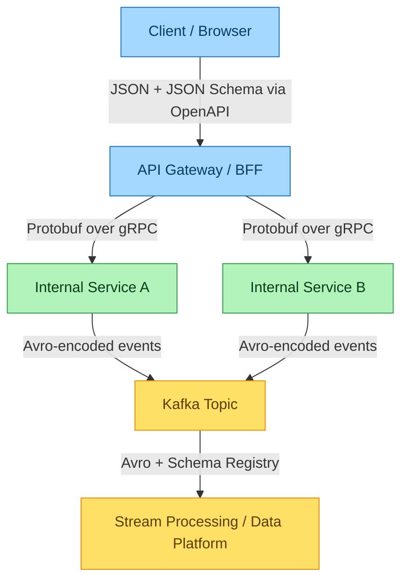

# Schema Evolution at the Boundary: Architectural Trade-Offs of Avro, Protobuf and JSON Schema

**Key Takeaways**

- Format selection should be driven by the system boundary a message crosses, not by team preference; public/browser edges favor JSON Schema, internal RPC favors Protobuf and streaming pipelines favor Avro because each format's evolution model matches a different failure mode at that boundary.
- Avro pushes compatibility logic into runtime schema resolution between a writer's schema and a reader's schema, which means the registry, not the code, becomes the enforcement point for safe changes, and losing the writer's schema makes the data unreadable.
- Protobuf's field-number contract survives renames and reordering by design, but proto3's implicit presence on scalar fields silently conflates "unset" with "default," so architects should require the `optional` keyword on any field where that distinction matters to the business.
- JSON Schema has the weakest built-in evolution guarantees of the three, which means REST API teams have to compensate with explicit `$id` versioning, `additionalProperties` discipline and contract tests, or they inherit breaking changes as production incidents instead of build failures.
- Treat schema registries and contract testing as the actual deliverable of a serialization strategy; the wire format is a commodity decision, but the compatibility policy attached to it is the thing that determines whether a schema change ships safely or breaks a consumer three teams away.

---

*By Wallace Espindola — [wallace.espindola@gmail.com](mailto:wallace.espindola@gmail.com) · [LinkedIn](https://www.linkedin.com/in/wallaceespindola/) · [GitHub](https://github.com/wallaceespindola/)*

*Companion repository with runnable code for every example in this article: [github.com/wallaceespindola/avro-protobuf-jsonschema](https://github.com/wallaceespindola/avro-protobuf-jsonschema)*

---

## The problem isn't the wire format, it's the next release

Every serialization decision looks trivial the day you make it. You pick JSON because the frontend team already speaks JSON. You pick Protobuf because gRPC ships with it. You pick Avro because the data engineering team already has a Kafka cluster and a schema registry running. None of that is wrong. What it misses is the question that actually matters six months later: what happens when the schema changes and one side of the wire hasn't redeployed yet?

That's the real design problem behind Avro, Protobuf and JSON Schema. They aren't really competing on encoding efficiency, even though comparison tables (including the one in this article's own companion repo) love to lead with payload size and throughput. They're competing on **how they handle disagreement between a producer and a consumer about what a message looks like**. A field gets added. A field gets removed. A type changes from optional to required. Someone forgets to redeploy a consumer on a Friday. The format you chose determines whether that's a non-event or an outage.

This article works through that trade-off at the architecture level, using a small reference implementation — a FastAPI service exposing the same `User` payload over `/json/user`, `/protobuf/user` and `/avro/user` — to ground the discussion in real schema definitions rather than abstract feature comparisons.

## Boundary-driven format selection, not framework preference

The reference implementation exposes three endpoints against the same logical entity: an integer ID, a name, an optional email and a boolean active flag. Same data, three different contracts. That repetition is deliberate. It's the same pattern you find in most mature systems that have grown past a single team and a single database: JSON at the public edge, Protobuf between internal services, Avro on the event bus.



**Legend**

| Color | Boundary | Format | Why |
|---|---|---|---|
| Blue | Public / browser edge | JSON Schema over OpenAPI | Human-readable, browser-native, tooling-rich |
| Green | Internal service-to-service | Protobuf over gRPC | Compact wire size, generated stubs, low latency |
| Yellow | Event streaming / data platform | Avro with a schema registry | Strongest schema evolution guarantees for long-lived data |

This isn't three teams disagreeing on a standard. It's boundary-driven format selection, and each boundary has a different tolerance for schema drift. A public API breaks trust with external developers if it changes shape without warning, so it needs a format with rich validation and clear versioning conventions. An internal gRPC call between two services you deploy together in the same release train can tolerate a tighter, more implicit contract because you control both ends. A Kafka topic might have a consumer that hasn't redeployed in eight months and a producer that redeployed twice since — that's the boundary where schema evolution correctness matters most, because you can't force every reader to be current.

The mistake worth calling out here: none of this means "use whichever format you already have services running." Each format's evolution semantics were built for one of these boundaries, and using the wrong one at the wrong boundary is where teams get burned — a public API defined only in Protobuf loses browser and curl-ability; an event stream defined only in JSON Schema loses the writer/reader schema resolution that makes Avro safe for long retention.

## Schema evolution semantics: where the guarantees actually come from

This is the part that separates a serialization format choice from an architecture decision. Each of the three formats solves "can I change this schema safely" in a structurally different way.

### Avro: schema resolution happens at read time, not compile time

Avro's core evolution mechanism is the distinction between the **writer's schema** (what was used to encode the bytes) and the **reader's schema** (what the consuming code expects). According to the official Avro specification, "a reader must use the schema used by the writer of the data in order to know how to read the data" — this pairing is what the spec calls schema resolution, and it's why Avro files and Avro-based RPC systems are required to carry or reference the writer's schema alongside the data ([Apache Avro Specification](https://avro.apache.org/docs/1.11.1/specification/)).

The resolution rules follow directly from that pairing. If the writer's record has a field the reader doesn't know about, the reader ignores it. If the reader's schema declares a field with a default value that the writer's schema doesn't have, the reader falls back to that default. That's the entire mechanism behind adding new fields without breaking old consumers, and removing old fields without breaking new consumers, as long as defaults are set correctly.

The reference implementation's Avro schema shows this pattern in miniature:

```json
{
  "type": "record",
  "name": "User",
  "namespace": "com.example",
  "fields": [
    {"name": "id", "type": "long"},
    {"name": "name", "type": "string"},
    {"name": "email", "type": ["null", "string"], "default": null},
    {"name": "is_active", "type": "boolean", "default": true}
  ]
}
```

`email` is a union of null and string with an explicit default. That's not decoration — it's what makes this field safely optional under Avro's resolution rules for both older and newer readers. The architectural implication is that Avro's safety net is only as good as your discipline around defaults; a field added without one is a field that will break every reader that predates it.

The trade-off nobody puts on the comparison slide: this only works if the writer's schema is actually available to the reader. Lose that pairing — a mislabeled topic, a schema registry outage, a service that serializes Avro to a flat file without embedding the schema header — and you have unreadable data, not gracefully degraded data. That's why Avro is "commonly paired with a schema registry" in Kafka deployments, as this repo's reference documentation notes, rather than left to ad hoc agreement between services.

### Protobuf: stability by field number, with a presence trap in proto3

Protobuf takes a different approach: it doesn't resolve two schemas against each other, it encodes a **field number** on the wire instead of a field name. The `.proto` definition for the reference service looks like this:

```proto
syntax = "proto3";

message User {
  int64 id = 1;
  string name = 2;
  string email = 3;
  bool is_active = 4;
}
```

Those trailing integers (`1`, `2`, `3`, `4`) are the actual evolution contract. You can rename `name` to `full_name` in your generated code without breaking any deployed consumer, because the wire format never carries the string `"name"` — it carries tag `2`. You can add field `5` and old consumers ignore it. You can deprecate field `3` and as long as nothing reuses that number, old producers and new consumers coexist safely. This is a genuinely strong evolution property, and it's why Protobuf remains the default for internal RPC at companies running large gRPC estates.

The gotcha is presence, and it's subtle enough that it belongs in every architecture review that touches Protobuf. In proto3, a scalar field declared without a label — like `bool is_active = 4` in the schema above — uses **implicit presence**: the generated API stores the value but not whether it was ever set, and default values are not serialized on the wire at all. According to the official Protocol Buffers documentation, "because default values are not serialized, there is no way to distinguish between a field set to its default value and a field that was never set" unless the field is marked `optional`, which switches it to explicit presence and tracks a has-bit the way proto2 always did ([Protocol Buffers: Field Presence](https://protobuf.dev/programming-guides/field_presence/)). The documentation's own recommendation is to add `optional` on proto3 scalar fields by default, because it's also the smoother migration path toward newer proto editions that use explicit presence.

For a field like `is_active`, that ambiguity is a business decision hiding inside a wire format detail: does a client that never sent the field mean "false" or "I have no opinion on this user's active status"? The reference schema in this repo doesn't use `optional` on any field, which is fine for a demo endpoint — but it's exactly the kind of default that should not survive a production architecture review unchanged.

### JSON Schema: evolution is a governance discipline, not a language feature

JSON Schema has no equivalent to writer/reader resolution or field-number stability. Compatibility is whatever the API team enforces by convention: keeping `additionalProperties` decisions consistent, not silently narrowing a `type`, not moving a field from optional to required without a version bump. The specification does give you a hook for this — the `$id` keyword, which JSON Schema's own documentation describes as the mechanism for giving a schema (or embedded sub-schema) a unique identifying URI, and the practical guidance from the spec community is to encode a version number into that `$id` (and the schema's `title`) so consumers can tell which contract version a document actually adheres to ([JSON Schema Draft 2020-12](https://json-schema.org/draft/2020-12), [JSON Schema Specification](https://json-schema.org/specification)).

That's a governance pattern, not a runtime guarantee. Nothing stops a team from publishing a breaking change under the same `$id`. This is precisely why JSON Schema pairs so naturally with OpenAPI and contract testing in REST ecosystems — the format's flexibility is also its risk surface, and the mitigation has to live in process (API versioning policy, consumer-driven contract tests, changelog discipline) rather than in the serialization layer itself. For a public-facing, browser-consumed API, that's usually an acceptable trade against the alternative: forcing every external client through code generation and binary parsing.

## Governance implications: the registry and the contract test are the real deliverable

Once you frame the three formats by their evolution semantics, the organizational implication follows directly: **the format decision is the easy part; the compatibility policy attached to it is the actual system you're building.**

For Avro on Kafka, that policy usually lives in a schema registry with an explicit compatibility mode. Confluent's Schema Registry documentation defines several: `BACKWARD` (the default), where consumers on the new schema can still read data written under the previous one; `FORWARD`, where consumers on the previous schema can still read data written under the new one; and `FULL`, which requires both directions simultaneously — plus transitive variants of each that check compatibility against every prior schema version, not just the latest one ([Confluent: Schema Evolution and Compatibility](https://docs.confluent.io/platform/current/schema-registry/fundamentals/schema-evolution.html)). Choosing `BACKWARD` compatibility, for instance, is what allows a consumer to rewind to the start of a topic and still deserialize years-old records — a requirement that has nothing to do with Avro's binary encoding and everything to do with an organizational decision about how long data has to remain readable.

For Protobuf, the equivalent governance artifact is a field-number allocation policy plus linting: never reuse a retired field number, never renumber a field, and treat `reserved` statements in the `.proto` file as permanent. Tools like `buf breaking` exist specifically to enforce this at CI time, because the format gives you the *capability* for safe evolution but nothing stops a careless PR from renumbering a field and quietly corrupting every message in flight during the deploy window.

For JSON Schema, the governance layer is contract testing between the API provider and its consumers — tools like Pact, or simply strict OpenAPI diffing in CI — because the schema itself won't stop a breaking change from shipping. The absence of a built-in resolution mechanism means the discipline has to be external, and teams that skip this step tend to discover incompatibilities in production logs instead of pull request reviews.

The pattern across all three: **the wire format sets the ceiling on what's evolvable; the governance layer determines whether you actually get there.** A team can pick Avro and still ship breaking changes if the registry compatibility mode is set to `NONE`. A team can pick JSON Schema and still run a disciplined, non-breaking public API if contract testing is rigorous. The format is necessary but not sufficient.

## Where each format falls short, and when that's fine

Being honest about the limits matters as much as the recommendation:

**Avro's schema resolution is only as strong as your registry discipline.** If you're doing point-to-point HTTP calls without a shared registry — which is what the reference implementation's `/avro/user` endpoint actually does, using "schemaless" encoding where client and server simply agree out of band on the schema — you've opted out of the registry-backed safety net and you're back to manual coordination. That's a reasonable choice for a small number of tightly coupled services; it stops being reasonable once more than two teams depend on the same event type.

**Protobuf's field-number stability doesn't help you with semantic changes.** Renaming a field is safe. Changing what a field *means* — say, redefining `is_active` from "account enabled" to "account verified" — is not something any wire format can catch. That's a code review and API-contract problem, not a serialization problem, and no amount of `optional` keywords will save you from it.

**JSON Schema's weak evolution guarantees are sometimes exactly the right trade.** For a public API with unknown external consumers you'll never get a deploy window from, the flexibility of JSON — extra fields ignored, missing optional fields tolerated, human-readable payloads that a partner engineer can debug with `curl` and their eyes — often outweighs the lack of formal compatibility resolution. The cost of that flexibility is that you have to actively engineer discipline into your API versioning strategy, rather than getting it from the wire format for free.

None of the three formats is wrong to choose. The mistake is choosing one everywhere because it was convenient at one boundary, and then discovering its evolution model doesn't fit a different boundary three services later.

## Summary

Avro, Protobuf and JSON Schema aren't interchangeable serialization options ranked by speed and payload size. They encode three different answers to "how do I change this schema without breaking someone downstream," and each answer fits a specific boundary: Avro's writer/reader resolution for long-lived streaming data behind a schema registry, Protobuf's field-number stability (with `optional` for honest presence) for internal RPC between services you control, and JSON Schema's flexible, convention-driven contract for public APIs where governance has to come from versioning discipline and contract tests rather than the format itself. The architectural decision that actually matters isn't which format to adopt — it's which compatibility policy you're willing to enforce at each boundary, and whether your registry, linter or contract-test suite actually enforces it instead of just documenting it.

## References

- [Apache Avro Specification — Schema Resolution](https://avro.apache.org/docs/1.11.1/specification/)
- [Protocol Buffers — Field Presence](https://protobuf.dev/programming-guides/field_presence/)
- [Protocol Buffers — Language Guide (proto3)](https://protobuf.dev/programming-guides/proto3/)
- [Confluent — Schema Evolution and Compatibility Types](https://docs.confluent.io/platform/current/schema-registry/fundamentals/schema-evolution.html)
- [JSON Schema — Draft 2020-12](https://json-schema.org/draft/2020-12)
- [JSON Schema — Specification](https://json-schema.org/specification)
- Companion repository with the FastAPI reference implementation used throughout this article: [github.com/wallaceespindola/avro-protobuf-jsonschema](https://github.com/wallaceespindola/avro-protobuf-jsonschema)

## About the author

Wallace Espindola is a senior software engineer and solution architect working across Java/Spring Boot and Python/FastAPI backends, cloud-native microservices on Kubernetes and OpenShift, and system architecture design. He maintains the open-source reference repository behind this article, comparing Avro, Protobuf and JSON Schema with runnable FastAPI endpoints for each format.

Contact: [wallace.espindola@gmail.com](mailto:wallace.espindola@gmail.com) · [LinkedIn](https://www.linkedin.com/in/wallaceespindola/) · [GitHub](https://github.com/wallaceespindola/)

---

**AI disclosure**: This article was drafted with AI assistance (Claude) for outlining, drafting and grammar/clarity review, based on the author's own reference repository and code. All technical claims were verified against the cited primary sources and the linked codebase.

**Publishing note**: This article is submitted for InfoQ's 4-week exclusive publishing window. It will not be cross-posted to other platforms until that window closes.

Need more tech insights?
Check out my GitHub, LinkedIn, and Speaker Deck.
Happy coding!
