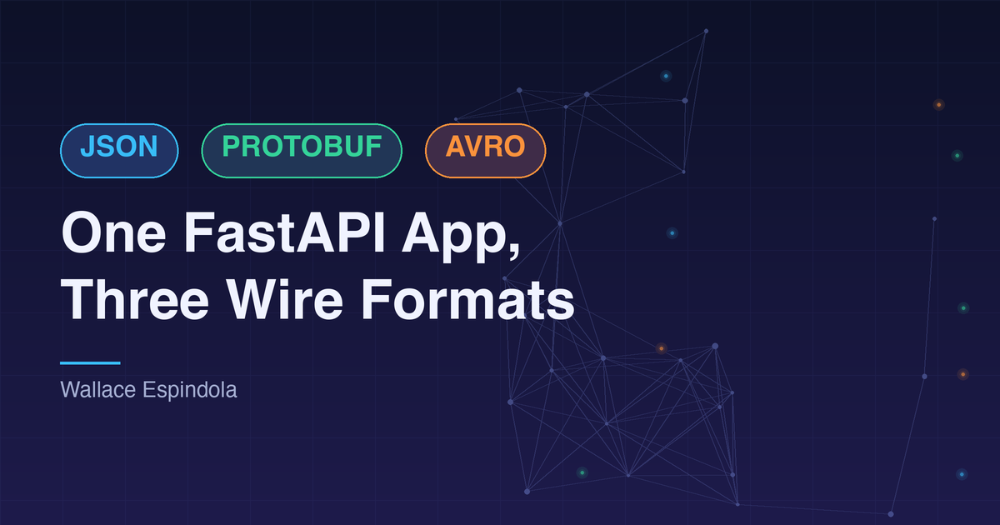

# One FastAPI App, Three Wire Formats: Lessons from Serving JSON, Protobuf and Avro Side by Side

*By Wallace Espindola — <wallace.espindola@gmail.com> — [LinkedIn](https://www.linkedin.com/in/wallaceespindola/) — [GitHub](https://github.com/wallaceespindola/)*

Companion repo: [github.com/wallaceespindola/avro-protobuf-jsonschema](https://github.com/wallaceespindola/avro-protobuf-jsonschema)

---

Most teams pick one wire format and move on. JSON for the public API, maybe Protobuf if there's gRPC somewhere in the stack, maybe Avro if there's a Kafka topic bolted on. What you rarely see written down anywhere is what it actually looks like to serve all three from the *same* app, side by side, so you can compare them honestly instead of arguing about it in a design doc.

That's what I built. One FastAPI app with three endpoints — `/json/user`, `/protobuf/user`, `/avro/user` — all representing the exact same `User` record. Same data, three different wire formats, three different sets of gotchas. This post walks through the real implementation, the parts that bit me, and how I tested it. Everything here comes straight from the [avro-protobuf-jsonschema](https://github.com/wallaceespindola/avro-protobuf-jsonschema) repo — no hand-waving, no pseudocode.

If you want the theory-first comparison (encoding, schema evolution, when to use what), I already wrote that up in the [reference doc](https://github.com/wallaceespindola/avro-protobuf-jsonschema/blob/main/docs/avro-protobuf-jsonschema-context.md). This post is the "here's what happens when you actually run it" companion.

## Why bother building all three in one app

Here's the thing: reading a comparison table about JSON vs Protobuf vs Avro tells you almost nothing about what breaks in practice. Tables don't show you that FastAPI's `Request.body()` behaves differently from a Pydantic model. They don't show you that `fastavro.schemaless_reader` takes a *third argument* you'll forget the first time. They don't show you that your CI pipeline will happily skip your Protobuf tests without telling you why, unless you're watching closely.

Putting all three formats in one codebase, hitting the same conceptual `User` object, forces you to confront every one of those details at once. You end up with a small, honest playground for a question that comes up in almost every architecture review I've sat in: *"why can't we just use JSON everywhere?"* Now I have a repo to point at instead of a slide.

## The shape of the data

Every endpoint in this project represents the same logical record:

- `id` — a positive integer
- `name` — a non-empty string
- `email` — optional string
- `is_active` — boolean, defaults to true

Three formats, three different ways of expressing "this field is optional" and "this field must be at least 1." That difference alone is worth the price of admission.

### JSON: Pydantic does the schema work for you

The JSON endpoint is the one every Python developer already knows how to write:

```python
class UserJSON(BaseModel):
    """User model for JSON endpoint using Pydantic validation."""

    id: int = Field(..., ge=1, description="User ID (must be >= 1)")
    name: str = Field(..., min_length=1, description="User name")
    email: str | None = Field(None, description="User email (optional)")
    is_active: bool = Field(True, description="Whether user is active")

    model_config = {
        "json_schema_extra": {
            "examples": [{"id": 1, "name": "Wallace", "email": "wallace@example.com", "is_active": True}]
        }
    }


@app.post("/json/user", response_model=UserJSON, tags=["JSON"])
def json_user(user: UserJSON) -> UserJSON:
    """
    JSON endpoint using Pydantic models.

    FastAPI automatically generates JSON Schema via OpenAPI for this endpoint.

    Content-Type: application/json
    """
    return user
```

Notice what's missing here: no manual validation code, no explicit content-type check, no try/except around parsing. FastAPI reads the `Content-Type: application/json` header, hands the body to Pydantic, and Pydantic either builds you a valid `UserJSON` or FastAPI returns a 422 with a field-level error message automatically. `ge=1` on the id and `min_length=1` on the name are doing real validation work — try posting `{"id": 0, "name": "Invalid User", "is_active": true}` and you get back a 422 with `"greater than or equal to 1"` in the response body, which is exactly what `tests/test_json_endpoint.py` checks for.

This is also where JSON Schema sneaks in through the back door. You never write a JSON Schema document by hand for this endpoint — FastAPI derives it from the Pydantic model and exposes it through OpenAPI at `/docs` and `/redoc`. That's the whole appeal of the JSON boundary: the schema is free, the validation is free, and the docs are free.

### Protobuf: raw bytes and a generated module

The Protobuf endpoint is a different animal entirely. There's no Pydantic model in sight — FastAPI's dependency injection doesn't know what a `.proto` message is, so you drop down to `Request` and handle bytes yourself:

```python
@app.post("/protobuf/user", tags=["Protobuf"])
async def protobuf_user(request: Request) -> Response:
    """
    Protobuf endpoint accepting raw binary protobuf messages.

    Content-Type: application/x-protobuf or application/octet-stream
    """
    if not PROTOBUF_AVAILABLE:
        raise HTTPException(
            status_code=503, detail="Protobuf support not available. Run 'make proto' to generate protobuf code."
        )

    ct = request.headers.get("content-type", "").split(";")[0].strip()
    if ct not in ("application/x-protobuf", "application/octet-stream"):
        raise HTTPException(
            status_code=415, detail="Use Content-Type: application/x-protobuf or application/octet-stream"
        )

    body = await request.body()
    msg = user_pb2.User()

    try:
        msg.ParseFromString(body)
    except Exception as e:
        raise HTTPException(status_code=400, detail=f"Invalid protobuf payload: {e}") from e

    if msg.id < 1:
        raise HTTPException(status_code=422, detail="id must be >= 1")

    return Response(content=msg.SerializeToString(), media_type="application/x-protobuf")
```

A few things worth calling out here, because they're the exact places where I've seen people get tripped up:

**There's no automatic body parsing.** `async def protobuf_user(request: Request)` — that's it. FastAPI won't try to coerce the body into anything because there's no type hint telling it to. You call `await request.body()` yourself and get raw bytes back. If you forget the `await`, you get a coroutine object instead of bytes, and `ParseFromString` throws something confusing that has nothing to do with Protobuf.

**Content-type negotiation is manual, and it's not one string.** The header comes in as something like `application/x-protobuf; charset=utf-8` in some clients, so the code splits on `;` and strips whitespace before comparing. Skip that step and you'll get intermittent 415s depending on which HTTP client sent the request. I also accept `application/octet-stream` as a fallback — plenty of clients and proxies default to that generic binary type when they don't know about `application/x-protobuf` specifically, and `tests/test_protobuf_endpoint.py` has a dedicated test (`test_protobuf_endpoint_with_octet_stream`) making sure that path works.

**Validation happens after parsing, not before.** With JSON, Pydantic validates before your function body even runs. With Protobuf, `ParseFromString` will happily succeed on a message where `id` is `0` — proto3 doesn't have a concept of "required" the way Pydantic does, so the `if msg.id < 1` check is doing work that Pydantic gave you for free on the other endpoint. This is the practical face of what the [reference doc](https://github.com/wallaceespindola/avro-protobuf-jsonschema/blob/main/docs/avro-protobuf-jsonschema-context.md) means when it talks about proto3 field presence: an empty string and an absent string look identical on the wire unless you explicitly use `optional`.

**The message needs to exist before you can import it.** `user_pb2` comes from running `protoc` against `schemas/user.proto`:

```proto
syntax = "proto3";

package com.example;

message User {
  int64 id = 1;
  string name = 2;
  string email = 3;       // proto3: empty string means "default"
  bool is_active = 4;
}
```

```bash
make proto
# runs: protoc --python_out=. --pyi_out=. schemas/user.proto
```

If you skip that step, `from schemas import user_pb2` raises `ImportError`, which the app catches at import time and sets `PROTOBUF_AVAILABLE = False`. Every request to `/protobuf/user` then returns a clean 503 instead of crashing the whole app. That try/except at import time is a small thing, but it's the difference between "the Protobuf endpoint is temporarily unavailable" and "the entire FastAPI app refuses to start because someone forgot to run one Make target."

### Avro: schemaless writer, schemaless reader, and a signature that will get you once

The Avro endpoint looks structurally similar to Protobuf — raw bytes in, raw bytes out — but the library-level details are different enough to deserve their own walkthrough:

```python
AVRO_USER_SCHEMA = parse_schema(
    {
        "type": "record",
        "name": "User",
        "namespace": "com.example",
        "fields": [
            {"name": "id", "type": "long"},
            {"name": "name", "type": "string"},
            {"name": "email", "type": ["null", "string"], "default": None},
            {"name": "is_active", "type": "boolean", "default": True},
        ],
    }
)


@app.post("/avro/user", tags=["Avro"])
async def avro_user(request: Request) -> Response:
    """
    Avro endpoint accepting schemaless Avro binary messages.

    Content-Type: application/avro or application/octet-stream
    """
    ct = request.headers.get("content-type", "").split(";")[0].strip()
    if ct not in ("application/avro", "application/octet-stream"):
        raise HTTPException(status_code=415, detail="Use Content-Type: application/avro or application/octet-stream")

    body = await request.body()
    try:
        record = cast(dict[str, Any], schemaless_reader(BytesIO(body), AVRO_USER_SCHEMA, None))
    except Exception as e:
        raise HTTPException(status_code=400, detail=f"Invalid avro payload: {e}") from e

    if record.get("id", 0) < 1:
        raise HTTPException(status_code=422, detail="id must be >= 1")

    out = BytesIO()
    schemaless_writer(out, AVRO_USER_SCHEMA, record)
    return Response(content=out.getvalue(), media_type="application/avro")
```

Two things I want to flag, because they were the actual friction points while building this:

**`schemaless_reader` takes three arguments, not two.** The signature is `schemaless_reader(fo, writer_schema, reader_schema=None)`. The first time you write this, it's natural to assume you only need the file object and the schema — after all, that's all `schemaless_writer` needs. But `fastavro`'s reader is built around the idea that the writer's schema and the reader's schema can be *different*, which is exactly how Avro's schema evolution story works: an old consumer with an old schema can still read data written with a newer schema, and vice versa, as long as the two are compatible. Passing `None` for the reader schema tells fastavro "assume the reader schema is the same as the writer schema," which is the right call for this demo since client and server share one `AVRO_USER_SCHEMA` object. In a real streaming pipeline with a schema registry, that third argument is where the evolution logic actually lives.

**"Schemaless" doesn't mean there's no schema — it means the schema isn't embedded in the payload.** Avro's container file format (the `.avro` files you'd write to disk or ship to a data lake) embeds the schema in the file header, which is why those files are self-describing. Over HTTP, embedding the schema in every request would be wasteful — you already know what the schema is, both sides agreed on it ahead of time. So this endpoint uses `schemaless_writer` and `schemaless_reader`, which just encode and decode the field values, in the exact order the schema defines, with no schema bytes on the wire at all. That's a deliberate trade-off: smaller payloads, but client and server *must* agree on the schema out of band. If they drift, you don't get a helpful error — you get silently misaligned fields, because Avro's binary encoding has no field tags the way Protobuf does. This is the one place in the whole project where getting the client and server schema definitions even slightly out of sync will hurt you the most, and it won't tell you clearly when it happens.

**`email` being nullable is expressed as a union type.** `{"type": ["null", "string"], "default": None}` is Avro's way of saying "this field can be null or a string, and if it's missing, treat it as null." Compare that to Protobuf's proto3 `string email = 3`, where there's no null at all — just an empty string standing in for "not set." Two binary formats, two completely different philosophies for the exact same optionality problem. JSON Schema, for what it's worth, expresses the same idea as `"type": ["string", "null"]` in the [standalone JSON Schema example](https://github.com/wallaceespindola/avro-protobuf-jsonschema/blob/main/docs/avro-protobuf-jsonschema-context.md) in the reference doc — syntactically close to Avro's union, but validated at a completely different layer of the stack.

## The gotchas, collected in one place

I scattered a few of these through the walkthrough above, but here they are together, because they're the actual reasons this pattern takes longer to build than it looks like it should.

**FastAPI won't parse binary bodies for you.** The JSON endpoint gets validation, parsing and docs generation for free because Pydantic and FastAPI are designed around that model. The moment you need raw bytes — Protobuf, Avro, or anything else that isn't JSON — you're back to `async def handler(request: Request)` and `await request.body()`. There's no shortcut here, and there shouldn't be one: FastAPI's whole value proposition on the JSON side comes from knowing the shape of the data ahead of time through type hints, and a binary blob doesn't have a shape FastAPI can introspect.

**Content-type checks need to handle parameters, not just exact strings.** `request.headers.get("content-type", "")` can come back as `application/x-protobuf; charset=utf-8` depending on the client. Both the Protobuf and Avro endpoints strip everything after the first `;` before comparing. Skip this and you'll get flaky 415s that only show up with certain HTTP clients or proxies in the path — the kind of bug that looks intermittent until you actually diff the raw headers.

**Codegen has to happen before tests run, and CI needs to know that.** `user_pb2.py` doesn't exist until `make proto` runs `protoc` against `schemas/user.proto`. That's an extra CI step most teams forget the first time they add a Protobuf endpoint — and it's exactly the kind of thing that turns into a recurring CI failure if the generated stub isn't either regenerated in CI or committed as a build artifact. This repo's own commit history has a fix specifically for that (committing the generated protobuf stubs so pre-commit and CI don't silently skip Protobuf checks). The test suite protects against the "forgot to generate" case too: `tests/test_protobuf_endpoint.py` wraps every test with `pytestmark = pytest.mark.skipif(not PROTOBUF_AVAILABLE, ...)`, so a missing `protoc` step degrades to skipped tests instead of a wall of import errors — which is better than a crash, but still means you need to actually look at the test output to notice Protobuf coverage silently dropped to zero.

**Validation logic duplicates itself across formats.** `id >= 1` is enforced once, automatically, by Pydantic's `Field(..., ge=1)` on the JSON side. On both the Protobuf and Avro endpoints, that exact same rule is a manual `if` statement after parsing. If your business rule changes — say, `id` now needs to be non-zero *and* under some maximum — you're updating three different validation strategies in three different styles, not just one field constraint. That's a real cost of running multiple wire formats for the same logical entity, and it's worth naming out loud instead of glossing over.

## Testing three formats without three testing strategies

The test suite lives in `tests/` and leans on one shared fixture in `conftest.py`:

```python
@pytest.fixture
def client() -> TestClient:
    """Create a test client for the FastAPI app."""
    return TestClient(app)
```

Every endpoint's tests build on that same `TestClient`, which keeps the testing story consistent even though the payloads are wildly different. The JSON tests look exactly like what you'd expect from any FastAPI project — post a dict, assert on `response.json()`:

```python
def test_json_endpoint_invalid_id(client: TestClient) -> None:
    """Test JSON endpoint with invalid ID (< 1)."""
    payload = {"id": 0, "name": "Invalid User", "is_active": True}
    response = client.post("/json/user", json=payload)
    assert response.status_code == 422
    assert "greater than or equal to 1" in response.text.lower()
```

The Protobuf and Avro tests follow the same round-trip shape — serialize a message, post it as raw bytes, deserialize the response, assert on the fields — but each one has to build its own message object first, because there's no `client.post(json=...)` shortcut when the body isn't JSON:

```python
def test_avro_endpoint_valid_user(client: TestClient, avro_schema) -> None:
    """Test Avro endpoint with valid user data."""
    record = {"id": 1, "name": "Wallace", "email": "wallace@example.com", "is_active": True}
    payload = serialize_avro(avro_schema, record)

    response = client.post("/avro/user", content=payload, headers={"Content-Type": "application/avro"})

    assert response.status_code == 200
    decoded = deserialize_avro(avro_schema, response.content)
    assert decoded["id"] == 1
    assert decoded["name"] == "Wallace"
```

Notice `content=payload`, not `json=payload` or `data=payload` — `httpx`'s test client (which `TestClient` wraps) needs `content=` for raw bytes, otherwise it tries to form-encode the body and you end up sending garbage. That's a one-word difference that cost me a confusing debugging session the first time I wired this up.

The negative-path tests are just as important as the happy-path ones, and each format needs its own version of the same three checks: wrong content-type (`test_avro_endpoint_wrong_content_type`, `test_protobuf_endpoint_wrong_content_type` — both expect a 415), malformed binary payload (`test_avro_endpoint_invalid_payload`, `test_protobuf_endpoint_invalid_payload` — both expect a 400), and business-rule violation on a structurally valid message (`test_avro_endpoint_invalid_id`, `test_protobuf_endpoint_invalid_id` — both expect a 422). Writing those three negative cases per format, on top of the happy path, is what actually catches the content-type-parameter bug and the "forgot the third arg to schemaless_reader" bug before they hit a real client.

For manual, outside-of-pytest testing, the repo also ships standalone clients in `clients/` — a curl script for JSON and small Python scripts for Protobuf and Avro that print out what they're sending and what came back, which is genuinely useful when you're debugging a content-type mismatch against a real running server instead of the in-process `TestClient`.

## When this pattern is actually worth it

I want to be straight about this: building three endpoints for one logical entity is *more work*, not less, and you shouldn't do it just because you can. The [reference doc](https://github.com/wallaceespindola/avro-protobuf-jsonschema/blob/main/docs/avro-protobuf-jsonschema-context.md) lays out the boundary-driven pattern this repo is modeling — JSON at the public/browser edge, Protobuf between internal services (especially anything gRPC), Avro at the streaming/data-pipeline boundary with Kafka and a schema registry. That's not overengineering. That's picking the right format for the constraints at each specific boundary, and most large systems really do end up with something like this shape:

```
Frontend / Public APIs (JSON + JSON Schema via OpenAPI)
                ↓
        API Gateway / BFF
                ↓
   Internal Services (Protobuf + gRPC)
                ↓
Event Streaming / Data Platform (Avro + Kafka + Schema Registry)
```

What this repo demonstrates is the *cost* of maintaining that shape inside one codebase: duplicated validation logic, a codegen step that CI has to remember, content-type negotiation you write by hand instead of getting for free, and test suites that can't share a single "post this and check the response" helper across formats. If your system genuinely spans those three boundaries — public API, internal service mesh, data pipeline — that cost is worth paying, and it's smaller than the cost of picking the wrong format at any one of those boundaries. If you're a five-person team with one API and no Kafka topic in sight, you don't need this. Use JSON, get FastAPI's automatic validation and docs, and revisit the question when a real Protobuf or Avro boundary actually shows up.

## Wrapping up

- FastAPI gives you validation, docs and parsing for free on the JSON boundary because Pydantic models tell it exactly what shape to expect — binary formats get none of that, by design.
- Protobuf and Avro endpoints both boil down to `await request.body()`, manual content-type checks that must strip parameters, and manual post-parse validation, because proto3 and Avro don't have Pydantic's "required field" concept.
- `fastavro.schemaless_reader`'s third argument (the reader schema) is where Avro's schema evolution story actually lives — passing `None` only works because this demo shares one schema between client and server.
- Codegen (`protoc` for Protobuf) has to run before tests can import the generated module, and your CI needs an explicit step for that or your Protobuf test coverage silently degrades to skipped tests.
- This pattern earns its complexity at real system boundaries — public API, internal services, streaming pipeline — not by default in every project.

The full working app, including the Makefile, Dockerfile and pytest suite, is on GitHub: [avro-protobuf-jsonschema](https://github.com/wallaceespindola/avro-protobuf-jsonschema). Clone it, run `make setup && make proto && make dev`, and hit all three endpoints yourself.

---

Need more tech insights?
Check out my GitHub, LinkedIn, and Speaker Deck.
Happy coding!
